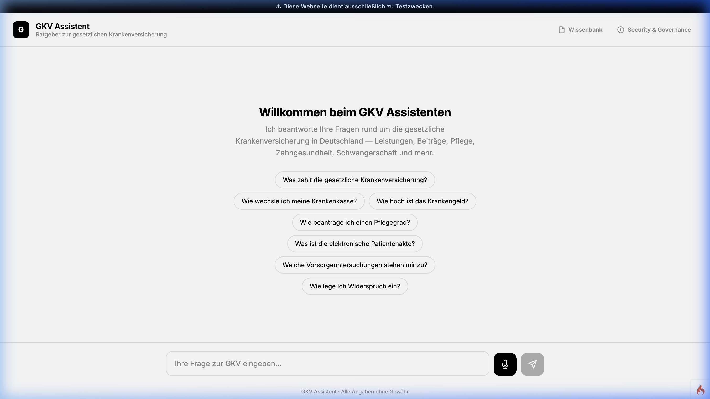
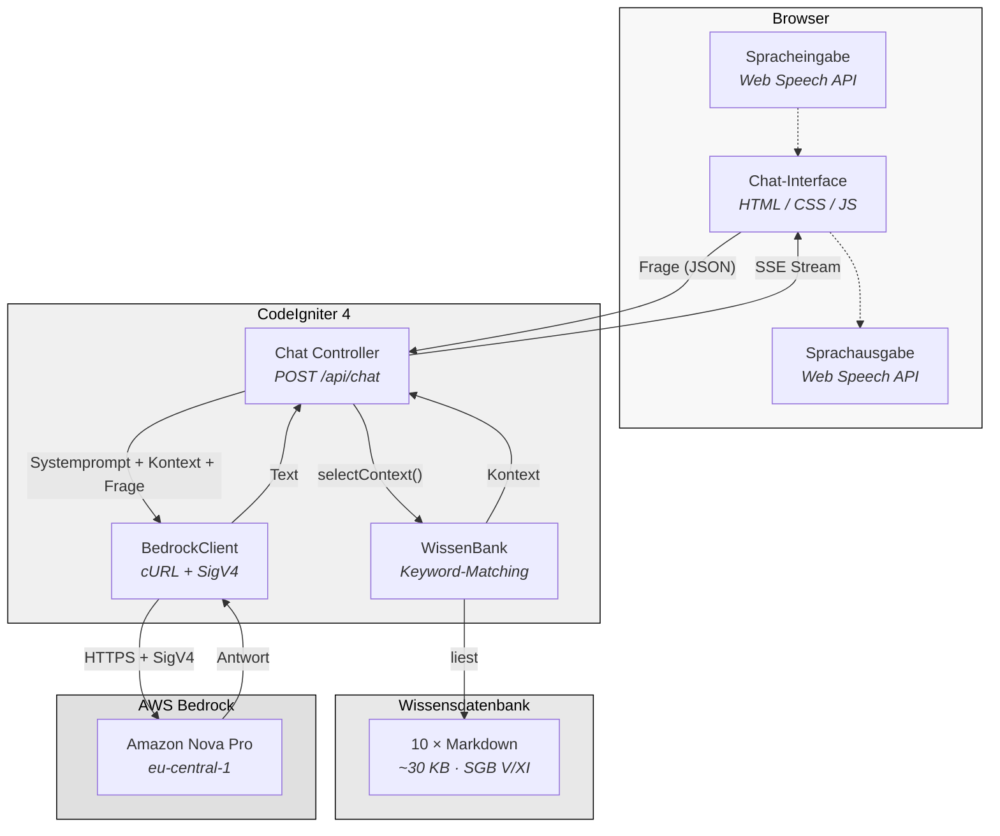
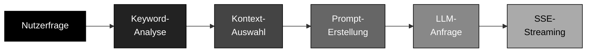

<p align="center">
  
</p>

<h1 align="center">GKV Assistent</h1>

<p align="center">
  <strong>KI-gestützter Ratgeber zur gesetzlichen Krankenversicherung in Deutschland</strong>
</p>

<p align="center">
  
  
  
  
  
</p>

---

## Überblick

Der **GKV Assistent** ist ein KI-Chatbot, der Fragen zur gesetzlichen Krankenversicherung (GKV) in Deutschland beantwortet. Er nutzt eine kuratierte Wissensdatenbank auf Basis von **SGB V** und **SGB XI** und generiert Antworten ausschließlich anhand dieser Fakten — ohne Halluzinationen.

**Kernprinzipien:**

- ⬛ **Kassenunabhängig** — Vertritt keine bestimmte Krankenkasse
- ⬛ **Faktenbasiert** — Antworten nur auf Basis der bereitgestellten Wissensbasis
- ⬛ **Keine erfundenen URLs** — Generiert keine Links oder Kontaktdaten
- ⬛ **Datenschutzkonform** — Keine Speicherung von Nutzerdaten

---

## Funktionen

| Funktion | Beschreibung |
|---|---|
| **Keyword-Retrieval** | Relevante Wissensdateien werden automatisch anhand der Nutzerfrage ausgewählt |
| **LLM-Antworten** | AWS Bedrock (Amazon Nova Pro) generiert Antworten auf Basis der Wissensbasis |
| **SSE-Streaming** | Antworten werden zeichenweise gestreamt (Typing-Effekt) |
| **Spracheingabe** | Browser-native Speech-to-Text (Deutsch) |
| **Sprachausgabe** | Text-to-Speech für Bot-Antworten |
| **Wissenbank-Viewer** | Interaktive Übersicht aller Wissensdateien |
| **Sicherheitsanalyse** | Governance & Safety Dokumentation |

---

## Projektstruktur

```
gkv-chatbot/
│
├── app/
│   ├── Controllers/
│   │   ├── BaseController.php        # Basis-Controller
│   │   ├── Chat.php                  # ◼ Chat-API (Systemprompt, SSE-Stream)
│   │   └── Home.php                  # Startseite → chat View
│   │
│   ├── Libraries/
│   │   ├── BedrockClient.php         # ◼ AWS Bedrock Client (cURL + SigV4)
│   │   └── WissenBank.php            # ◼ Keyword-basierte Kontextauswahl
│   │
│   ├── Views/
│   │   └── chat.php                  # ◼ Frontend (HTML/CSS/JS)
│   │
│   └── Config/
│       ├── Routes.php                #   API-Routen
│       └── ...                       #   CodeIgniter Konfiguration
│
├── wissenBank/                       # ◼ Wissensdatenbank (10 Markdown-Dateien)
│   ├── 01_gkv_system.md              #   GKV-System, SGB V, Kassenarten
│   ├── 02_versicherungsarten.md      #   Pflicht-/Familien-/freiwillige Versicherung
│   ├── 03_beitraege.md               #   Beitragssätze, Grenzen, Zuzahlungen
│   ├── 04_leistungen_vorsorge.md     #   Pflichtleistungen, Vorsorge, Prävention
│   ├── 05_krankengeld.md             #   Krankengeld, eAU, Kinderkrankengeld
│   ├── 06_pflege.md                  #   Pflegegrade, Pflegegeld, SGB XI
│   ├── 07_zahngesundheit.md          #   Zahnersatz, Bonusheft, Kieferorthopädie
│   ├── 08_schwangerschaft_familie.md #   Schwangerschaft, U-Untersuchungen
│   ├── 09_digitale_services.md       #   ePA, DiGA, E-Rezept, eGK
│   └── 10_rechte_beschwerden.md      #   Widerspruch, Patientenrechte, UPD
│
├── public/
│   ├── index.php                     #   Einstiegspunkt
│   ├── wissenbank.html               #   Wissenbank-Viewer
│   └── gov_safety.html               #   Sicherheitsanalyse
│
├── docs/
│   └── screenshot.png                #   Screenshot für README
│
├── .env.example                      #   Beispiel-Konfiguration
├── composer.json                     #   PHP-Abhängigkeiten
└── README.md                         #   Diese Datei
```

---

## Architektur



---

## Antwort-Pipeline



**Ablauf im Detail:**

1. **Keyword-Analyse** — Die Nutzerfrage wird in Kleinbuchstaben analysiert und mit dem Keyword-Index abgeglichen
2. **Kontext-Auswahl** — Die relevantesten Wissensdateien werden nach Score sortiert ausgewählt (max. 30.000 Zeichen)
3. **Prompt-Erstellung** — Systemprompt + Wissensbasis-Kontext + Chatverlauf werden zusammengesetzt
4. **LLM-Anfrage** — AWS Bedrock wird via SigV4-signiertem HTTPS-Request angefragt
5. **SSE-Streaming** — Die Antwort wird in 8-Byte-Blöcken per Server-Sent Events gestreamt

---

## Wissensbasis

Die Wissensdatenbank besteht aus **10 kuratierten Markdown-Dateien** mit insgesamt ~30 KB Inhalt. Alle Informationen basieren auf den gesetzlichen Grundlagen (SGB V, SGB XI) und sind kassenunabhängig.

| # | Datei | Thema | Schlüsselwörter |
|---|---|---|---|
| 01 | `gkv_system` | GKV-Überblick | Solidarprinzip, G-BA, Kassenarten |
| 02 | `versicherungsarten` | Mitgliedschaft | Pflicht, freiwillig, Familie, PKV |
| 03 | `beitraege` | Beitragssätze | Zusatzbeitrag, Grenzen, Zuzahlungen |
| 04 | `leistungen_vorsorge` | Leistungen | Vorsorge, Impfungen, Hilfsmittel |
| 05 | `krankengeld` | Krankengeld | eAU, 78 Wochen, Kinderkrankengeld |
| 06 | `pflege` | Pflegeversicherung | Pflegegrade, Pflegegeld, MD |
| 07 | `zahngesundheit` | Zahngesundheit | Festzuschuss, Bonusheft, PZR |
| 08 | `schwangerschaft_familie` | Familie | Mutterschaftsgeld, U-Untersuchungen |
| 09 | `digitale_services` | Digitales | ePA, DiGA, E-Rezept, eGK |
| 10 | `rechte_beschwerden` | Beschwerden | Widerspruch, UPD, BAS, Sozialgericht |

---

## Installation

### Voraussetzungen

- **PHP 8.2+** mit cURL-Erweiterung
- **Composer**
- **AWS-Konto** mit Zugriff auf Amazon Bedrock (Region `eu-central-1`)

### Einrichtung

```bash
# Repository klonen
git clone https://github.com/mhmdgazzar/gkv-chatbot.git
cd gkv-chatbot

# Abhängigkeiten installieren
composer install

# Konfiguration erstellen
cp .env.example .env

# .env bearbeiten: AWS-Zugangsdaten eintragen
nano .env

# Entwicklungsserver starten
php spark serve --port 8080
```

Anschließend im Browser öffnen: **http://localhost:8080**

---

## Konfiguration

Alle Einstellungen werden über die `.env`-Datei gesteuert:

```env
# AWS Bedrock Zugangsdaten
AWS_ACCESS_KEY_ID     = YOUR_KEY
AWS_SECRET_ACCESS_KEY = YOUR_SECRET
AWS_REGION            = eu-central-1
BEDROCK_MODEL_ID      = eu.amazon.nova-pro-v1:0
```

---

## API-Endpunkte

| Methode | Pfad | Beschreibung |
|---|---|---|
| `POST` | `/api/chat` | Chat-Nachricht senden (SSE-Response) |
| `GET` | `/api/health` | Systemstatus prüfen |
| `GET` | `/api/wissen/{datei}` | Wissensdatei lesen |

---

## Technologie

| Komponente | Technologie |
|---|---|
| Backend | PHP 8.2 · CodeIgniter 4.7 |
| LLM | AWS Bedrock · Amazon Nova Pro |
| Authentifizierung | AWS SigV4 (eigene Implementierung) |
| Frontend | Vanilla HTML · CSS · JavaScript |
| Schriftart | Inter (Google Fonts) |
| Spracherkennung | Web Speech API (Browser-nativ) |

---

## Lizenz

Dieses Projekt steht unter der [MIT-Lizenz](LICENSE).

